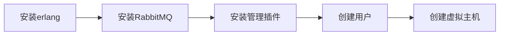

## 1. 消息队列概述

**目标**：能够说出什么是消息队列；为什么使用消息队列；常见产品有哪些

**小结**：

消息队列是应用程序之间的通信方法；无需即时返回的且耗时的操作进行异步处理从而提高系统的吞吐量；可以实现程序之间的解耦合。

- 实现方式：AMQP，JMS
- 常见产品：activeMQ，zeroMQ，RabbitMQ，RocketMQ，kafka

## 2. 安装及配置RabbitMQ

**目标**：按照文档在本机安装windows版本RabbitMQ，并配置其用户和Virtual Hosts

**分析**：

1. 安装erlang；
2. 安装rabbitMQ；
3. 安装RabbitMQ的图形管理界面插件；
4. 创建管理用户；
5. 创建虚拟主机Virtual Hosts

**小结**：



> 安装上述的组件时候都需要使用以管理员身份运行。

## 3. 搭建RabbitMQ入门工程

**目标**：搭建RabbitMQ入门工程并配置对应的maven依赖

**分析**：

创建heima-rabbitmq的工程；用于测试RabbitMQ的消息收发。添加用于操作RabbitMQ的依赖。

```xml
        <dependency>
            <groupId>com.rabbitmq</groupId>
            <artifactId>amqp-client</artifactId>
            <version>5.6.0</version>
        </dependency>
```

**小结**：

使用IDEA创建maven工程；使用了jdk1.8。在工程中的pom.xml文件中添加了上述的依赖。

## 4. 入门工程-生产者

**目标**：编写消息生产者代码，发送消息到队列

**分析**：

入门工程：生产者发送消息到RabbitMQ的队列（simple_queue）；消费者可以从队列中获取消息。可以使用RabbitMQ的简单模式（simple）。

生产者实现发送消息的步骤：

1. 创建连接工厂（设置RabbitMQ的连接参数）；
2. 创建连接；
3. 创建频道；
4. 声明队列；
5. 发送消息；
6. 关闭资源

**小结**：

```java
package com.itheima.rabbitmq.simple;

import com.rabbitmq.client.Channel;
import com.rabbitmq.client.Connection;
import com.rabbitmq.client.ConnectionFactory;

/**
 * 简单模式：发送消息
 */
public class Producer {
    static final String QUEUE_NAME = "simple_queue";

    public static void main(String[] args) throws Exception {
        //1. 创建连接工厂（设置RabbitMQ的连接参数）；
        ConnectionFactory connectionFactory = new ConnectionFactory();
        //主机；默认localhost
        connectionFactory.setHost("localhost");
        //连接端口；默认5672
        connectionFactory.setPort(5672);
        //虚拟主机；默认/
        connectionFactory.setVirtualHost("/itcast");
        //用户名；默认guest
        connectionFactory.setUsername("heima");
        //密码；默认guest
        connectionFactory.setPassword("heima");

        //2. 创建连接；
        Connection connection = connectionFactory.newConnection();
        //3. 创建频道；
        Channel channel = connection.createChannel();
        //4. 声明队列；
        /**
         * 参数1：队列名称
         * 参数2：是否定义持久化队列（消息会持久化保存在服务器上）
         * 参数3：是否独占本连接
         * 参数4：是否在不使用的时候队列自动删除
         * 参数5：其它参数
         */
        channel.queueDeclare(QUEUE_NAME, true, false, false, null);
        //5. 发送消息；
        String message = "你好！小兔纸。";

        /**
         * 参数1：交换机名称；如果没有则指定空字符串（表示使用默认的交换机）
         * 参数2：路由key，简单模式中可以使用队列名称
         * 参数3：消息其它属性
         * 参数4：消息内容
         */
        channel.basicPublish("", QUEUE_NAME, null, message.getBytes());
        System.out.println("已发送消息：" + message);
        //6. 关闭资源
        channel.close();
        connection.close();
    }
}
```

> 在设置连接工厂的时候；如果没有指定连接的参数则会有默认值；可以去设置虚拟主机。

## 5. 入门工程-消费者

**目标**：编写消息消费者代码，从队列中接收消息并消费

**分析**：

从RabbitMQ中队列（与生产者发送消息时的队列一致；simple_queue）接收消息；

实现消费者步骤：

1. 创建连接工厂；
2. 创建连接；（抽取一个获取连接的工具类）
3. 创建频道；
4. 声明队列；
5. 创建消费者（接收消息并处理消息）；
6. 监听队列

**小结**：

```java
package com.itheima.rabbitmq.simple;

import com.itheima.rabbitmq.util.ConnectionUtil;
import com.rabbitmq.client.*;

import java.io.IOException;

/**
 * 简单模式；消费者接收消息
 */
public class Consumer {
    public static void main(String[] args) throws Exception {
        //1. 创建连接工厂；
        //2. 创建连接；（抽取一个获取连接的工具类）
        Connection connection = ConnectionUtil.getConnection();
        //3. 创建频道；
        Channel channel = connection.createChannel();
        //4. 声明队列；
        /**
         * 参数1：队列名称
         * 参数2：是否定义持久化队列（消息会持久化保存在服务器上）
         * 参数3：是否独占本连接
         * 参数4：是否在不使用的时候队列自动删除
         * 参数5：其它参数
         */
        channel.queueDeclare(Producer.QUEUE_NAME, true, false, false, null);
        //5. 创建消费者（接收消息并处理消息）；
        DefaultConsumer defaultConsumer = new DefaultConsumer(channel){
            @Override
            public void handleDelivery(String consumerTag, Envelope envelope, AMQP.BasicProperties properties, byte[] body) throws IOException {
                //路由key
                System.out.println("路由key为：" + envelope.getRoutingKey());
                //交换机
                System.out.println("交换机为：" + envelope.getExchange());
                //消息id
                System.out.println("消息id为：" + envelope.getDeliveryTag());
                //接收到的消息
                System.out.println("接收到的消息为：" + new String(body, "utf-8"));
            }
        };
        //6. 监听队列
        /**
         * 参数1：队列名
         * 参数2：是否要自动确认；设置为true表示消息接收到自动向MQ回复接收到了，MQ则会将消息从队列中删除；
         * 如果设置为false则需要手动确认
         * 参数3：消费者
         */
        channel.basicConsume(Producer.QUEUE_NAME, true, defaultConsumer);
    }
}

```

> 需要持续监听队列消息，所以不要关闭资源

## 6. 入门工程测试

**目标**：启动消费者和生产者，到RabbitMQ中查询队列并在消费者端IDEA控制台查看接收到的消息

**分析**：

生产者：发送消息到RabbitMQ队列（simple_queue）

消费者：接收RabbitMQ队列消息


**小结**：

简单模式：生产者发送消息到队列中，一个消费者从队列中接收消息。

> 在RabbitMQ中消费者只能从队列接收消息。
>
> 如果接收消息的消费者在同一个队列中有两个或多个时；消息是如何分配的？

## 7. Work queues工作队列模式

**目标**：编写生产者、消费者代码并测试了解Work queues工作队列模式的特点

**分析**：

工作队列模式：在同一个队列中可以有多个消费者，消费者之间对于消息的接收是竞争关系。

生产者：发送10个消息

```java
package cn.xujian.producer;

import com.rabbitmq.client.Channel;
import com.rabbitmq.client.Connection;
import com.rabbitmq.client.ConnectionFactory;

import java.io.IOException;
import java.util.concurrent.TimeoutException;

/**
 * @param:
 * @return:
 * @auther: xj
 * @date: 2021-05-11 22:01
 * @description:发送消息
*/
public class Producer_WorkQueues {
    public static void main(String[] args) throws IOException, TimeoutException {
//    创建连接工厂
        ConnectionFactory factory = new ConnectionFactory();
//    设置参数
        factory.setHost("127.0.0.1");  //默认为localhost
        factory.setPort(5672);  //默认为5672
        factory.setVirtualHost("/xujian");   //设置虚拟机
        factory.setUsername("xujian");
        factory.setPassword("xujian");
//    获取连接 Connection
        Connection connection = factory.newConnection();
//    创建channel
        Channel channel = connection.createChannel();
//    创建队列
        /**
         * 参数1：队列名称  queue
         * 参数2：是否定义持久化队列（消息会持久化保存在服务器上） durable
         * 参数3：是否独占本连接    exclusive
         * 参数4：是否在不使用的时候队列自动删除  autoDelete
         * 参数5：其它参数  arguments
         */
//        如果没有hello_world的队列则自动创建
        channel.queueDeclare("work_queues",true,false,false,null);
        /**
         * 参数1：交换机名称；如果没有则指定空字符串（表示使用默认的交换机）
         * 参数2：路由key，简单模式中可以使用队列名称
         * 参数3：消息其它属性
         * 参数4：消息内容
         */
        //    发送消息
        for (int i = 0; i < 10; i++) {
            String message = i + "hello xujian boy";
            channel.basicPublish("", "work_queues", null, message.getBytes());
            System.out.println("已发送消息：" + message);
        }

        //6. 关闭资源
        channel.close();
        connection.close();
    }


}
```

消费者：创建两个消费者监听同一个队列，查看两个消费者的接收消息是否存在重复。

```java
package cn.xujian.consumer;

import com.rabbitmq.client.*;

import java.io.IOException;
import java.util.concurrent.TimeoutException;

/**
 * @param:
 * @return:
 * @auther: xj
 * @date: 2021-05-11 22:50
 * @description:work模式，消费者接收消息
*/
public class Consumer_WorkQueues1 {
    public static void main(String[] args) throws IOException, TimeoutException {
        //    创建连接工厂
        ConnectionFactory factory = new ConnectionFactory();
//    设置参数
        factory.setHost("127.0.0.1");  //默认为localhost
        factory.setPort(5672);  //默认为5672
        factory.setVirtualHost("/xujian");   //设置虚拟机
        factory.setUsername("xujian");
        factory.setPassword("xujian");
//    获取连接 Connection
        Connection connection = factory.newConnection();
//    创建channel
        Channel channel = connection.createChannel();
//    创建队列
        /**
         * 参数1：队列名称  queue
         * 参数2：是否定义持久化队列（消息会持久化保存在服务器上） durable
         * 参数3：是否独占本连接    exclusive
         * 参数4：是否在不使用的时候队列自动删除  autoDelete
         * 参数5：其它参数  arguments
         */
//        如果没有hello_world的队列则自动创建
        channel.queueDeclare("work_queues",true,false,false,null);
        /**
         * 参数1：交换机名称；如果没有则指定空字符串（表示使用默认的交换机）
         * 参数2：路由key，简单模式中可以使用队列名称
         * 参数3：消息其它属性
         * 参数4：消息内容
         */
        //5. 创建消费者（接收消息并处理消息）；
        DefaultConsumer defaultConsumer = new DefaultConsumer(channel){
            @Override
            public void handleDelivery(String consumerTag, Envelope envelope, AMQP.BasicProperties properties, byte[] body) throws IOException {
//                //路由key
//                System.out.println("路由key为：" + envelope.getRoutingKey());
//                //交换机
//                System.out.println("交换机为：" + envelope.getExchange());
//                //消息id
//                System.out.println("消息id为：" + envelope.getDeliveryTag());
                //接收到的消息
                System.out.println("接收到的消息为：" + new String(body, "utf-8"));
            }
        };
        //6. 监听队列
        /**
         * 参数1：队列名
         * 参数2：是否要自动确认；设置为true表示消息接收到自动向MQ回复接收到了，MQ则会将消息从队列中删除；
         * 如果设置为false则需要手动确认
         * 参数3：消费者
         */
        channel.basicConsume("work_queues", true, defaultConsumer);

    }
}
```


**小结**：

工作队列模式：一个消息只能被一个消费者接收，其它消费者是不能接收到同一条消息的。

应用场景：可以在消费者端处理任务比较耗时的时候；添加对同一个队列的消费者来提高任务处理能力。

## 8. 订阅模式类型说明

**目标**：说出订阅模式中的Exchange交换机作用以及交换机的三种类型

**小结**：

订阅模式与前面的两种模式比较：多了一个角色Exchange交换机，接收生产者发送的消息并决定如何投递消息到其绑定的队列；消息的投递决定于交换机的类型。

交换机类型：广播（fanout）、定向（direct）、通配符（topic）

> 交换机只做消息转发，自身不存储数据。

## 9. Publish/Subscribe发布与订阅模式

**目标**：编写生产者、消费者代码并测试了解Publish/Subscribe发布与订阅模式的特点

**分析**：

发布与订阅模式特点：一个消息可以被多个消费者接收；其实是使用了订阅模式，交换机类型为：fanout广播

- 生产者（发送消息）
  1. 创建连接；
  
  2. 创建频道；
  
  3. 声明交换机（fanout）；
  
  4. 声明队列；
  
  5. 队列绑定到交换机；
  
  6. 发送消息；
  
  7. 关闭资源
  
     ```java
     package cn.xujian.producer;
     
     import com.rabbitmq.client.BuiltinExchangeType;
     import com.rabbitmq.client.Channel;
     import com.rabbitmq.client.Connection;
     import com.rabbitmq.client.ConnectionFactory;
     
     import java.io.IOException;
     import java.util.Date;
     import java.util.concurrent.TimeoutException;
     
     /**
      * @param:
      * @return:
      * @auther: xj
      * @date: 2021-05-11 22:01
      * @description:发送消息
     */
     public class Producer_PubSub {
         public static void main(String[] args) throws IOException, TimeoutException {
     //    创建连接工厂
             ConnectionFactory factory = new ConnectionFactory();
     //    设置参数
             factory.setHost("127.0.0.1");  //默认为localhost
             factory.setPort(5672);  //默认为5672
             factory.setVirtualHost("/xujian");   //设置虚拟机
             factory.setUsername("xujian");
             factory.setPassword("xujian");
     //    获取连接 Connection
             Connection connection = factory.newConnection();
     //    创建channel
             Channel channel = connection.createChannel();
     //    创建交换机
     //        String exchange, String type, boolean durable, boolean autoDelete, boolean internal, Map<String, Object> arguments
     /*
     *       exchange:  交换机名称
     *       type：      交换机的类型：广播、定向、通配符、参数匹配
     *       durable：   是否持久化
     *       autoDelete  自动删除
     *       internal    内部使用，一般false
     *       arguments   参数
     * */
             String exchangeName = "test_fanout";
             channel.exchangeDeclare(exchangeName, BuiltinExchangeType.FANOUT,true,false,false,null);
     //    创建队列
             String queue1Name = "test_fanout_queue1";
             String queue2Name = "test_fanout_queue2";
             channel.queueDeclare(queue1Name,true, false,false,null);
             channel.queueDeclare(queue2Name,true, false,false,null);
     //    绑定队列和交换机
             /*
             * queue  队列名称
             * exchange 交换机名称
             * routingKey  路由键，绑定名称   如果交换机类型为fanout，routingKey设置为”“
             * */
             channel.queueBind(queue1Name,exchangeName,"");
             channel.queueBind(queue2Name,exchangeName,"");
     //    发送消息
             String body = "日志信息：调用了findall方法....日志级别：info";
             channel.basicPublish(exchangeName,"",null,body.getBytes());
     //    释放资源
             channel.close();
             connection.close();
         }
     
     
     }
     ```
- 消费者（至少两个消费者）
  1. 创建连接；
  
  2. 创建频道；
  
  3. 声明交换机；
  
  4. 声明队列；
  
  5. 队列绑定到交换机；
  
  6. 创建消费者；
  
  7. 监听队列；
  
     ```java
     package cn.xujian.consumer;
     
     import com.rabbitmq.client.*;
     
     import java.io.IOException;
     import java.util.concurrent.TimeoutException;
     
     /**
      * @param:
      * @return:
      * @auther: xj
      * @date: 2021-05-11 22:50
      * @description:pubsub模式，消费者接收消息
     */
     public class Consumer_PubSub2 {
         public static void main(String[] args) throws IOException, TimeoutException {
             //    创建连接工厂
             ConnectionFactory factory = new ConnectionFactory();
     //    设置参数
             factory.setHost("127.0.0.1");  //默认为localhost
             factory.setPort(5672);  //默认为5672
             factory.setVirtualHost("/xujian");   //设置虚拟机
             factory.setUsername("xujian");
             factory.setPassword("xujian");
     //    获取连接 Connection
             Connection connection = factory.newConnection();
     //    创建channel
             Channel channel = connection.createChannel();
             String queue2Name = "test_fanout_queue2";
             //5. 创建消费者（接收消息并处理消息）；
             DefaultConsumer defaultConsumer = new DefaultConsumer(channel){
                 @Override
                 public void handleDelivery(String consumerTag, Envelope envelope, AMQP.BasicProperties properties, byte[] body) throws IOException {
     //                //路由key
     //                System.out.println("路由key为：" + envelope.getRoutingKey());
     //                //交换机
     //                System.out.println("交换机为：" + envelope.getExchange());
     //                //消息id
     //                System.out.println("消息id为：" + envelope.getDeliveryTag());
                     //接收到的消息
                     System.out.println("接收到的消息为：" + new String(body, "utf-8"));
                     System.out.println("将日志信息保存");
                 }
             };
             //6. 监听队列
             /**
              * 参数1：队列名
              * 参数2：是否要自动确认；设置为true表示消息接收到自动向MQ回复接收到了，MQ则会将消息从队列中删除；
              * 如果设置为false则需要手动确认
              * 参数3：消费者
              */
             channel.basicConsume(queue2Name, true, defaultConsumer);
     
         }
     }
     ```

**小结**：

发布与订阅模式：**一个消息可以被多个消费者接收**；一个消费者对于的队列，该队列只能被一个消费者监听。使用了订阅模式中交换机类型为：广播。

## 10. Routing路由模式

**目标**：编写生产者、消费者代码并测试了解Routing路由模式的特点

**分析**：

生产者：发送两条消息（路由key分别为：info、error）

```java
package cn.xujian.producer;

import com.rabbitmq.client.BuiltinExchangeType;
import com.rabbitmq.client.Channel;
import com.rabbitmq.client.Connection;
import com.rabbitmq.client.ConnectionFactory;

import java.io.IOException;
import java.util.concurrent.TimeoutException;

/**
 * @param:
 * @return:
 * @auther: xj
 * @date: 2021-05-11 22:01
 * @description:发送消息
*/
public class Producer_Routing {
    public static void main(String[] args) throws IOException, TimeoutException {
//    创建连接工厂
        ConnectionFactory factory = new ConnectionFactory();
//    设置参数
        factory.setHost("127.0.0.1");  //默认为localhost
        factory.setPort(5672);  //默认为5672
        factory.setVirtualHost("/xujian");   //设置虚拟机
        factory.setUsername("xujian");
        factory.setPassword("xujian");
//    获取连接 Connection
        Connection connection = factory.newConnection();
//    创建channel
        Channel channel = connection.createChannel();
//    创建交换机
//        String exchange, String type, boolean durable, boolean autoDelete, boolean internal, Map<String, Object> arguments
/*
*       exchange:  交换机名称
*       type：      交换机的类型：广播、定向、通配符、参数匹配
*       durable：   是否持久化
*       autoDelete  自动删除
*       internal    内部使用，一般false
*       arguments   参数
* */
        String exchangeName = "test_direct";
        channel.exchangeDeclare(exchangeName, BuiltinExchangeType.DIRECT,true,false,false,null);
//    创建队列
        String queue1Name = "test_direct_queue1";
        String queue2Name = "test_direct_queue2";
        channel.queueDeclare(queue1Name,true, false,false,null);
        channel.queueDeclare(queue2Name,true, false,false,null);
//    绑定队列和交换机
        /*
        * queue  队列名称
        * exchange 交换机名称
        * routingKey  路由键，绑定名称   如果交换机类型为fanout，routingKey设置为”“
        * */
//        队列1绑定 error
        channel.queueBind(queue1Name,exchangeName,"error");
//        队列2绑定 info error waring
        channel.queueBind(queue2Name,exchangeName,"info");
        channel.queueBind(queue2Name,exchangeName,"error");
        channel.queueBind(queue2Name,exchangeName,"warning");
//    发送消息

//        测试info级别
//        String body = "日志信息：调用了findall方法....日志级别：info";
//        channel.basicPublish(exchangeName,"info",null,body.getBytes());

//        测试error级别
        String body = "日志信息：调用了delete方法....日志级别：error";
        channel.basicPublish(exchangeName,"error",null,body.getBytes());
//    释放资源
        channel.close();
        connection.close();
    }


}
```

消费者：创建两个消费者，监听的队列分别绑定路由key

```java
package cn.xujian.consumer;

import com.rabbitmq.client.*;

import java.io.IOException;
import java.util.concurrent.TimeoutException;

/**
 * @param:
 * @return:
 * @auther: xj
 * @date: 2021-05-11 22:50
 * @description:pubsub模式，消费者接收消息
*/
public class Consumer_Routing1 {
    public static void main(String[] args) throws IOException, TimeoutException {
        //    创建连接工厂
        ConnectionFactory factory = new ConnectionFactory();
//    设置参数
        factory.setHost("127.0.0.1");  //默认为localhost
        factory.setPort(5672);  //默认为5672
        factory.setVirtualHost("/xujian");   //设置虚拟机
        factory.setUsername("xujian");
        factory.setPassword("xujian");
//    获取连接 Connection
        Connection connection = factory.newConnection();
//    创建channel
        Channel channel = connection.createChannel();
        String queue1Name = "test_direct_queue1";
        //5. 创建消费者（接收消息并处理消息）；
        DefaultConsumer defaultConsumer = new DefaultConsumer(channel){
            @Override
            public void handleDelivery(String consumerTag, Envelope envelope, AMQP.BasicProperties properties, byte[] body) throws IOException {
//                //路由key
//                System.out.println("路由key为：" + envelope.getRoutingKey());
//                //交换机
//                System.out.println("交换机为：" + envelope.getExchange());
//                //消息id
//                System.out.println("消息id为：" + envelope.getDeliveryTag());
                //接收到的消息
                System.out.println("接收到的消息为：" + new String(body, "utf-8"));
                System.out.println("将日志信息保存");
            }
        };
        //6. 监听队列
        /**
         * 参数1：队列名
         * 参数2：是否要自动确认；设置为true表示消息接收到自动向MQ回复接收到了，MQ则会将消息从队列中删除；
         * 如果设置为false则需要手动确认
         * 参数3：消费者
         */
        channel.basicConsume(queue1Name, true, defaultConsumer);

    }
}
```

1. 消息中路由key为error的会被绑定路由key为error的队列接收并被其监听的消费者接收、处理；
2. 消息中路由key为info的会被绑定路由key为info的队列接收并被其监听的消费者接收、处理；

**小结**：

Routing 路由模式要求队列绑定到交换机的时候指定路由key；消费发送时候需要携带路由key；只有消息的路由key与队列路由key完全一致才能让该队列接收到消息。

## 11. Topics通配符模式

**目标**：编写生产者、消费者代码并测试了解Topics通配符模式的特点

**分析**：

- 生产者：

  ```java
  package cn.xujian.producer;
  
  import com.rabbitmq.client.BuiltinExchangeType;
  import com.rabbitmq.client.Channel;
  import com.rabbitmq.client.Connection;
  import com.rabbitmq.client.ConnectionFactory;
  
  import java.io.IOException;
  import java.util.concurrent.TimeoutException;
  
  /**
   * @param:
   * @return:
   * @auther: xj
   * @date: 2021-05-11 22:01
   * @description:发送消息
  */
  public class Producer_Topic {
      public static void main(String[] args) throws IOException, TimeoutException {
  //    创建连接工厂
          ConnectionFactory factory = new ConnectionFactory();
  //    设置参数
          factory.setHost("127.0.0.1");  //默认为localhost
          factory.setPort(5672);  //默认为5672
          factory.setVirtualHost("/xujian");   //设置虚拟机
          factory.setUsername("xujian");
          factory.setPassword("xujian");
  //    获取连接 Connection
          Connection connection = factory.newConnection();
  //    创建channel
          Channel channel = connection.createChannel();
  //    创建交换机
  /*
  *       exchange:  交换机名称
  *       type：      交换机的类型：广播、定向、通配符、参数匹配
  *       durable：   是否持久化
  *       autoDelete  自动删除
  *       internal    内部使用，一般false
  *       arguments   参数
  * */
          String exchangeName = "test_topic";
          channel.exchangeDeclare(exchangeName, BuiltinExchangeType.TOPIC,true,false,false,null);
  //    创建队列
          String queue1Name = "test_topic_queue1";
          String queue2Name = "test_topic_queue2";
          channel.queueDeclare(queue1Name,true, false,false,null);
          channel.queueDeclare(queue2Name,true, false,false,null);
  //    绑定队列和交换机
          /*
          * queue  队列名称
          * exchange 交换机名称
          * routingKey  路由键，绑定名称   如果交换机类型为fanout，routingKey设置为”“
          * */
  
  //        routing key  系统的名称.日志的级别         需求：所有error级别和order系统的日志存入数据库
  //        队列1绑定
          channel.queueBind(queue1Name,exchangeName,"#.error");
          channel.queueBind(queue1Name,exchangeName,"order.*");
  //        队列2绑定
          channel.queueBind(queue2Name,exchangeName,"*.*");
  
  //    发送消息
  
  //        测试order系统
  //        String body = "日志信息：调用了findall方法....日志级别：info";
  //        channel.basicPublish(exchangeName,"order.info",null,body.getBytes());
  
  //        测试error级别
  //        String body = "日志信息：调用了delete方法....日志级别：error";
  //        channel.basicPublish(exchangeName,"order.error",null,body.getBytes());
  
  //        测试无order系统和error级别
          String body = "日志信息：调用了find方法....日志级别：info";
          channel.basicPublish(exchangeName,"good.info",null,body.getBytes());
  
  //    释放资源
          channel.close();
          connection.close();
      }
  
  
  }
  ```

- 消费者1：

  ```java
  package cn.xujian.consumer;
  
  import com.rabbitmq.client.*;
  
  import java.io.IOException;
  import java.util.concurrent.TimeoutException;
  
  /**
   * @param:
   * @return:
   * @auther: xj
   * @date: 2021-05-11 22:50
   * @description:pubsub模式，消费者接收消息
  */
  public class Consumer_Topic1 {
      public static void main(String[] args) throws IOException, TimeoutException {
          //    创建连接工厂
          ConnectionFactory factory = new ConnectionFactory();
  //    设置参数
          factory.setHost("127.0.0.1");  //默认为localhost
          factory.setPort(5672);  //默认为5672
          factory.setVirtualHost("/xujian");   //设置虚拟机
          factory.setUsername("xujian");
          factory.setPassword("xujian");
  //    获取连接 Connection
          Connection connection = factory.newConnection();
  //    创建channel
          Channel channel = connection.createChannel();
          String queue1Name = "test_topic_queue1";
          //5. 创建消费者（接收消息并处理消息）；
          DefaultConsumer defaultConsumer = new DefaultConsumer(channel){
              @Override
              public void handleDelivery(String consumerTag, Envelope envelope, AMQP.BasicProperties properties, byte[] body) throws IOException {
  //                //路由key
  //                System.out.println("路由key为：" + envelope.getRoutingKey());
  //                //交换机
  //                System.out.println("交换机为：" + envelope.getExchange());
  //                //消息id
  //                System.out.println("消息id为：" + envelope.getDeliveryTag());
                  //接收到的消息
                  System.out.println("接收到的消息为：" + new String(body, "utf-8"));
                  System.out.println("将日志信息保存");
              }
          };
          //6. 监听队列
          /**
           * 参数1：队列名
           * 参数2：是否要自动确认；设置为true表示消息接收到自动向MQ回复接收到了，MQ则会将消息从队列中删除；
           * 如果设置为false则需要手动确认
           * 参数3：消费者
           */
          channel.basicConsume(queue1Name, true, defaultConsumer);
  
      }
  }
  ```

- 消费者2：

**小结**：

Topics通配符模式：可以根据路由key将消息传递到对应路由key的队列；队列绑定到交换机的路由key可以有多个；通配符模式中路由key可以使用 `*` 和 `#` ；使用了通配符模式之后对于路由Key的配置更加灵活。

## 12. RabbitMQ模式总结

**目标**：对比总结RabbitMQ的5种模式特征

**小结**：

- 不直接Exchange交换机（默认交换机）
  1. simple简单模式：一个生产者生产一个消息到一个队列被一个消费者接收
  2. work工作队列模式：生产者发送消息到一个队列中，然后可以被多个消费者监听该队列；一个消息只能被一个消费者接收，消费者之间是竞争关系
- 使用Exchange交换机；订阅模式（交换机：广播fanout、定向direct、通配符topic）
  1. 发布与订阅模式：使用了fanout广播类型的交换机，可以将一个消息发送到所有绑定了该交换机的队列
  2. 路由模式：使用了direct定向类型的交换机，消费会携带路由key，交换机根据消息的路由key与队列的路由key进行对比，一致的话那么该队列可以接收到消息
  3. 通配符模式：使用了topic通配符类型的交换机，消费会携带路由key（*， #），交换机根据消息的路由key与队列的路由key进行对比，匹配的话那么该队列可以接收到消息

## 13. 创建SpringBoot整合RabbitMQ的两个工程

**目标**：创建springboot-rabbitmq-producer工程用于生产消息；创建springboot-rabbitmq-consumer工程用于接收消息

**分析**：

Spring Boot提供了对于AMQP的整合；可以使用RabbitTemplate发送消息；可以使用@RabbitListener注解接收消息。

**生产者工程springboot-rabbitmq-producer**：发送消息

1. 创建工程；
2. 添加依赖（spring-boot-stater-amqp，spring-boot-starter-test）；
3. 创建启动引导类；
4. 添加配置文件application.yml

**消费者工程springboot-rabbitmq-consumer**：接收消息

1. 创建工程；
2. 添加依赖（spring-boot-stater-amqp）；
3. 创建启动引导类；
4. 添加配置文件application.yml

**小结**：

> 可以使用插件自动生产Spring Boot工程的启动引导类Application.java和配置文件application.yml

## 14. 配置生产者工程

**目标**：配置springboot-rabbitmq-producer工程的RabbitMQ，一个交换机、队列并绑定

**分析**：

使用通配符模式：将队列绑定到交换机（topic）时需要指定路由key（item.#）

1. 配置RabbitMQ的连接参数：主机、连接端口、虚拟主机、用户名、密码；
2. 声明交换机、队列并将队列绑定到交换机，指定的路由key（item.#）

**小结**：

- 配置application.yml文件

```yml
spring:
  rabbitmq:
    host: localhost
    port: 5672
    virtual-host: /itcast
    username: heima
    password: heima
```


- 配置交换机、队列和绑定，创建一个配置类

```java
@Configuration
public class RabbitMQConfig {
    //交换机名称
    public static final String ITEM_TOPIC_EXCHANGE = "item_topic_exchange";

    //队列名称
    public static final String ITEM_QUEUE = "item_queue";

    //声明交换机
    @Bean("itemTopicExchange")
    public Exchange topicExchange(){
        return ExchangeBuilder.topicExchange(ITEM_TOPIC_EXCHANGE).durable(true).build();
    }

    //声明队列
    @Bean("itemQueue")
    public Queue itemQueue(){
        return QueueBuilder.durable(ITEM_QUEUE).build();
    }

    //将队列绑定到交换机
    @Bean
    public Binding itemQueueExchange(@Qualifier("itemQueue") Queue queue,
                                     @Qualifier("itemTopicExchange")Exchange exchange){
        return BindingBuilder.bind(queue).to(exchange).with("item.#").noargs();
    }
}

```


## 15. 配置消费者工程

**目标**：配置springboot-rabbitmq-consumer工程的RabbitMQ，编写消息监听器接收消息

**分析**：

1. 配置application.yml文件，设置RabbitMQ的连接参数；
2. 编写消息监听器接收队列（item_queue）消息；可以使用注解@RabbitListener接收队列消息

**小结**：

- 配置application.yml文件；与生产者工程一致
- 编写监听器类

```java
@Component
public class MyListener {

    /**
     * 接收队列消息
     * @param message 接收到的消息
     */
    @RabbitListener(queues = "item_queue")
    public void myListener1(String message){
        System.out.println("消费者接收到消息：" + message);
    }
}

```

> 接收消息的队列名称要与生产者发送消息时的队列名称一致

## 16. 测试消息发送和接收

**目标**：生产者编写测试类RabbitMQTest发送消息到交换机和特定的路由（item.insert，item.update，item.delete）

**分析**：

生产者：编写测试类RabbitMQTest，利用RabbitTemplate发送3条消息，这3条消息的路由key分别是item.insert，item.update，item.delete

消费者：在IDEA控制台查看是否能接收到符合路由key的消息

**小结**：

编写测试类如下：

```java
package com.itheima.rabbitmq;

import com.itheima.rabbitmq.config.RabbitMQConfig;
import org.junit.Test;
import org.junit.runner.RunWith;
import org.springframework.amqp.rabbit.core.RabbitTemplate;
import org.springframework.beans.factory.annotation.Autowired;
import org.springframework.boot.test.context.SpringBootTest;
import org.springframework.test.context.junit4.SpringRunner;

@RunWith(SpringRunner.class)
@SpringBootTest
public class RabbitMQTest {

    @Autowired
    private RabbitTemplate rabbitTemplate;

    @Test
    public void test(){
        rabbitTemplate.convertAndSend(RabbitMQConfig.ITEM_TOPIC_EXCHANGE,
                "item.insert", "商品新增,路由Key为item.insert");
        rabbitTemplate.convertAndSend(RabbitMQConfig.ITEM_TOPIC_EXCHANGE,
                "item.update", "商品新增,路由Key为item.update");
        rabbitTemplate.convertAndSend(RabbitMQConfig.ITEM_TOPIC_EXCHANGE,
                "item.delete", "商品新增,路由Key为item.delete");
        rabbitTemplate.convertAndSend(RabbitMQConfig.ITEM_TOPIC_EXCHANGE,
                "a.item.delete", "商品新增,路由Key为a.item.delete");
    }
}

```

> 先启动测试类进行声明交换机、队列和绑定；之后再启动消费者工程接收消息。